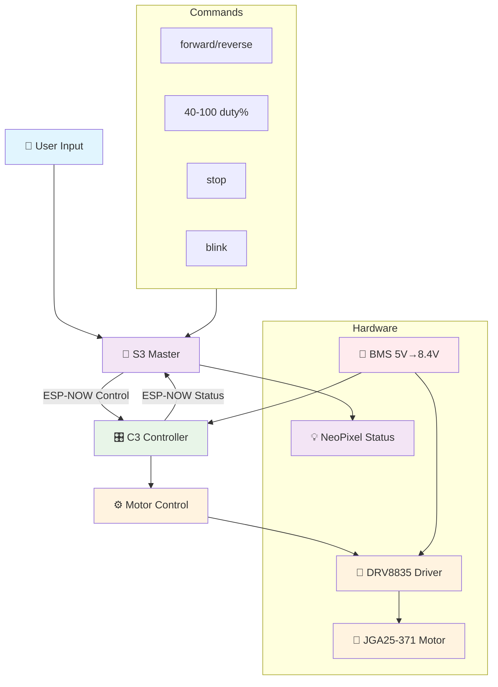

# FYP Firmware Testing

## Overview
Both the S3 and C3 boards interface with each other via ESP-NOW for wireless motor control communication.

**S3** assumes the role of "master" (command interface)  
**C3** assumes the role of "servant" (motor controller)

## Hardware Setup

### C3 Motor Controller
- **Motor Driver**: Pololu DRV8835 Dual Motor Driver Carrier
- **Motor**: JGA25-371 Gear Motor with Encoder DC 12V 1360RPM  
- **Power**: BMS (5V USB-C input → 8.4V output to motor driver, 5V to C3)
- **Connections**:
  - Pin 2 (BENABLE) → DRV8835 B Channel Enable (PWM)
  - Pin 3 (BPHASE) → DRV8835 B Channel Phase (Direction)

### S3 Command Interface
- **LED**: WS2812B NeoPixel on GPIO 48
- **Interface**: Serial commands via USB

## Communication Protocol

### Control Commands (S3 → C3)
```cpp
struct ControlPacket {
  uint8_t duty_cycle; // 40-100%
  uint8_t direction;  // 0=reverse, 1=forward  
  uint8_t enable;     // 0=stop, 1=run
};
```

### Status Reports (C3 → S3)  
```cpp
struct StatusPacket {
  uint8_t current_duty;     // Current duty cycle %
  uint8_t current_direction; // Current direction
  uint8_t motor_running;    // Motor status
};
```

### PWM Configuration
- **Fixed Frequency**: 20 kHz
- **Duty Cycle Range**: 40-100% (variable motor speed)
- **Resolution**: 8-bit PWM

## System Flow Diagram



## Available Commands (S3 Serial Interface)
- `forward` - Set motor direction forward
- `reverse` - Set motor direction reverse  
- `stop` - Disable motor
- `blink` - Test S3 NeoPixel LED
- `40-100` - Set motor duty cycle percentage

## MAC Addresses (Hardcoded)
- **S3**: `30:ED:A0:27:8F:A4`
- **C3**: `A0:76:4E:7B:9A:B4`